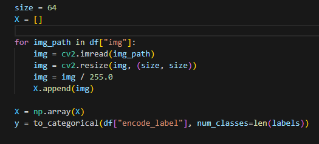
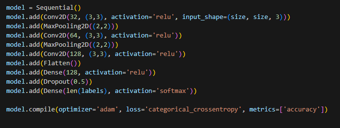
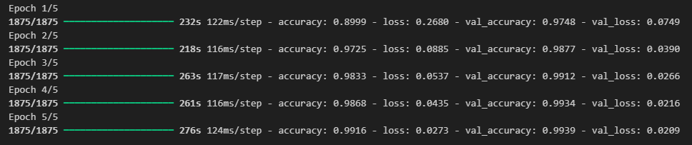
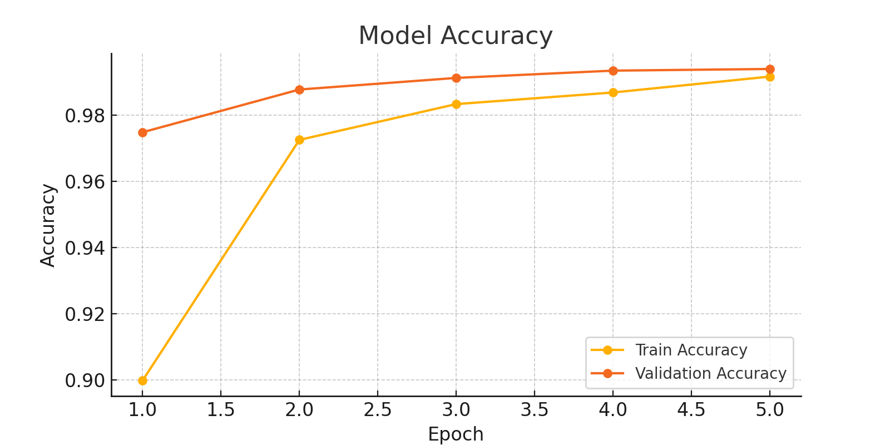
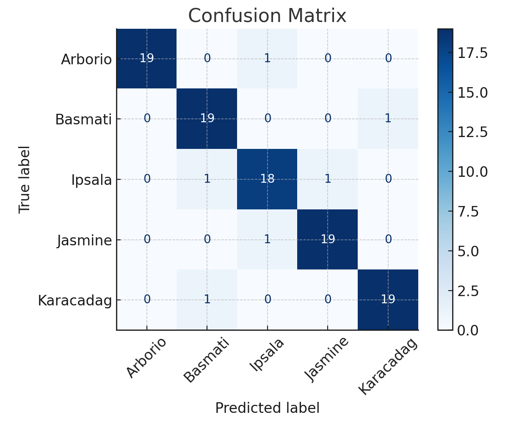

## 1. Proje Amacı

Bu projede, farklı pirinç türlerini sınıflandırmak amacıyla bir derin öğrenme modeli geliştirilmiştir. Veri seti Kaggle ortamında sağlanmış ve model eğitimi de yine Kaggle üzerinde yapılmıştır. Proje veri ön işleme, modelleme, eğitim ve değerlendirme aşamalarından oluşmaktadır.

**Pirinç Türleri:** Arborio , Basmati, Ipsala , Jasmine, Karacadag

---

## 2. Gerekli Kütüphaneler

```python
import os
import cv2
import numpy as np
import pandas as pd
import matplotlib.pyplot as plt
from sklearn.model_selection import train_test_split
from sklearn.metrics import classification_report, confusion_matrix
import seaborn as sns
from tensorflow.keras.models import Sequential
from tensorflow.keras.layers import Conv2D, MaxPooling2D, Flatten, Dense, Dropout
from tensorflow.keras.utils import to_categorical
```

---

## 3. Veri Seti Hazırlığı ve Etiketleme

Veri setindeki resimler okunmuş ve her resim ait olduğu pirinç türüne göre etiketlenmiştir. Etiketler encode edilerek modele uygun hale getirilmiştir.

---

## 4. Görsel Ön İşleme

Resimler 64x64 boyutuna küçültülmüş, normalleştirilmiş ve sınıflar one-hot encoding ile sayısallaştırılmıştır.


---

## 5. Eğitim ve Test Ayrımı

Veri seti %80 eğitim ve %20 test olacak şekilde bölünmüştür.

---

## 6. Model Kurulumu

Model şu katmanlardan oluşmaktadır:

- 3 adet `Conv2D` katmanı
- `MaxPooling2D` katmanları
- `Flatten` katmanı
- `Dense` ve `Dropout` katmanları
- Son katmanda `softmax` aktivasyonu

Model, `adam` optimizer ve `categorical_crossentropy` kayıp fonksiyonu ile derlenmiştir.



---

## 7. Model Eğitimi

Model 5 epoch boyunca eğitilmiş ve doğrulama verisi ile başarı oranı takip edilmiştir.

---

## 8. Eğitim Sonuçları



- Epoch 1: Accuracy: 0.8999, Val Accuracy: 0.9748  
- Epoch 2: Accuracy: 0.9725, Val Accuracy: 0.9877  
- Epoch 3: Accuracy: 0.9833, Val Accuracy: 0.9912  
- Epoch 4: Accuracy: 0.9868, Val Accuracy: 0.9934  
- Epoch 5: Accuracy: 0.9916, Val Accuracy: 0.9939  

---

## 9. Sonuç

Modelin doğruluk oranı %99.39'a ulaşmış ve başarıyla sınıflandırma yapabilmiştir.  
Validation accuracy > Train accuracy olması, modelin overfit olmadığını göstermektedir.

---

## 10. Grafikler

### 📈 Doğruluk (Accuracy) Grafiği


### 📉 Kayıp (Loss) Grafiği


### 📊 Confusion Matrix


---
